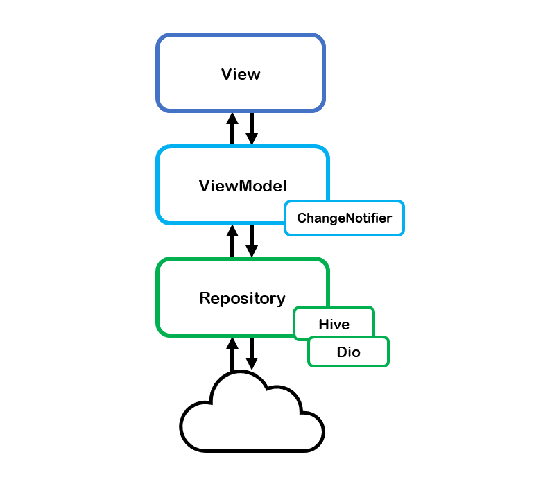

# Blood-Mate-Frontend

Blood Mate Frontend Repository

## Tech Dependences
1. Network : Dio
2. Local Storage Management : Hive
3. State Management : Provider

## App Architecture
- Base on MVVM, and Repository


## Models
If you want to add models for api results
- Freezed Annotation

## Getting Started
```
flutter pub get
```
```
flutter run --dart-define=BASE_URL='Bloodmate Server Endpoint'
```