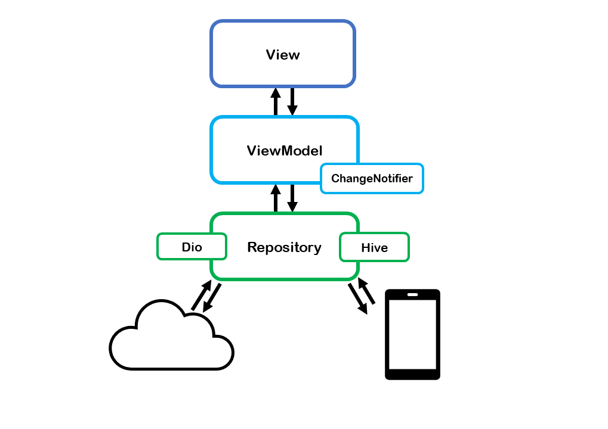

# Blood-Mate-Frontend

Blood Mate Frontend Repository

## Tech Dependences
1. Network : Dio
2. Local Storage Management : Hive
3. State Management : Provider

## App Architecture
- Base on MVVM, and Repository


## View
- An app is made up of pages that contain multiple widgets.

## ViewModel
- Corresponds to a page 1:1, but the widgets within the page share one ViewModel.

## Repository
- Contains APIs for data that ViewModel uses. Communicates with the server using the Dio package and can also use data from local storage. Local storage is managed using the Hive package.

## Api Models
If you want to add models for api results
- Freezed Annotation

## Getting Started
```
flutter pub get
```
```
flutter run --dart-define=BASE_URL='Bloodmate Server Endpoint'
```